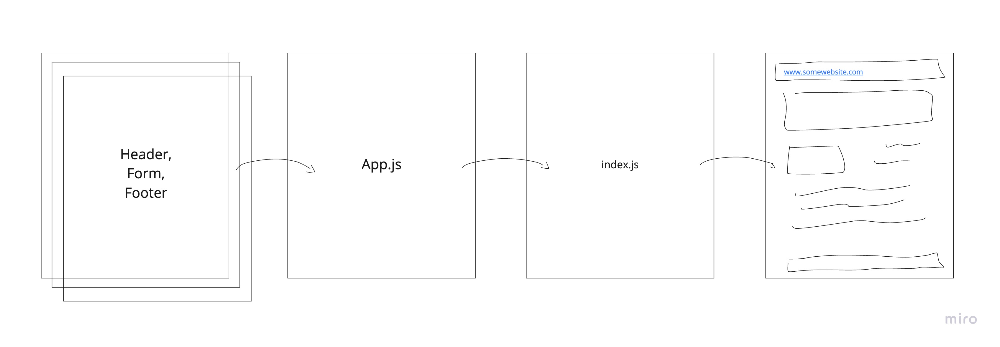
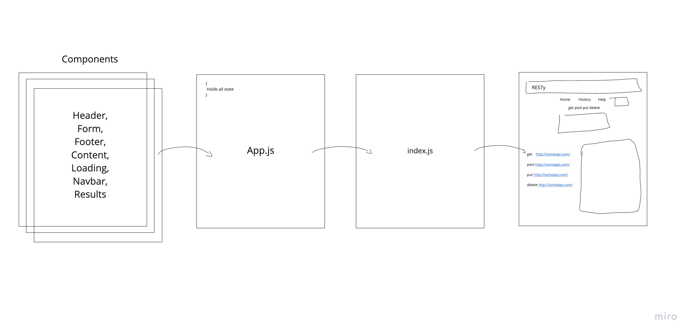

# Getting Started with Create React App

This project was bootstrapped with [Create React App](https://github.com/facebook/create-react-app).

## LAB 26: Component Based UI -  Overview

The purpose of this lab was to set up basic scaffolding of the application, with intent being to add more functionality to the system later.

## LAB 27: Props and State -  Overview

The purpose of this lab was to set up basic scaffolding of the application, with intent being to add more functionality to the system later.

## LAB 28: Component Composition

The purpose of this lab was to set up basic scaffolding of the application, with intent being to add more functionality to the system later.

## Problem Domain

### LAB 26

The following user/developer stories detail the major functionality for this phase of the project.

- As a user, I expect an easy to read and understand user interface so that I can use the application intuitively
- As a user, I want to enter the URL to a REST API and select the REST method to use to access it
- As a user, I want visual confirmation that my entries and selections are valid so that I have confidence the application will be able to fetch the API data that I’ve requested

And as developers, here are the high level development tasks that address the above end user requirements

- Create a visually appealing site with a Header, Footer, and a large content area
- Create a form that asks for a URL
- Create buttons that let the user choose from the REST methods (get, post, put, delete)
When the form is filled out, and the button is clicked, display the URL and the method chosen

### LAB 27

The following user stories detail the major functionality for this phase of the project.

- As a user, I want to enter the URL to an API and issue a GET request so that I can retrieve it’s data
- As a user, I want to see the results returned from an API request in my browser in a readable format

### LAB 28

In this phase of the RESTy build, we will be adding some more fidelity to the application, including a menu, history, and an “in-progress” spinner.

The following user stories detail the major functionality for this phase of the project.

- As a user, I want to be able to use all REST methods so that I can do more than just get data
- As a user, I want a simple list of all previous queries I’ve run so that I can easily see which queries I’ve run before
- As a user, I want to click on an old query and have my selections appear in the form for me, so I don’t have to re-type them
- As a user, I want to see a “loading” indicator while RESTy is fetching data so that I know it’s working on my request

## Required Node Modules

- `npm i`
  - axios
  - msw
  - react
  - react-json-view
  - react-router-dom
  - sass
  - uuid
  - react-if

## Available Scripts

In the project directory, you can run:

### `npm start`

Runs the app in the development mode.\
Open [http://localhost:3000](http://localhost:3000) to view it in the browser.

The page will reload if you make edits.\
You will also see any lint errors in the console.

### `npm test`

Launches the test runner in the interactive watch mode.\
See the section about [running tests](https://facebook.github.io/create-react-app/docs/running-tests) for more information.

### `npm run build`

Builds the app for production to the `build` folder.\
It correctly bundles React in production mode and optimizes the build for the best performance.

The build is minified and the filenames include the hashes.\
Your app is ready to be deployed!

See the section about [deployment](https://facebook.github.io/create-react-app/docs/deployment) for more information.

### `npm run eject`

**Note: this is a one-way operation. Once you `eject`, you can’t go back!**

If you aren’t satisfied with the build tool and configuration choices, you can `eject` at any time. This command will remove the single build dependency from your project.

Instead, it will copy all the configuration files and the transitive dependencies (webpack, Babel, ESLint, etc) right into your project so you have full control over them. All of the commands except `eject` will still work, but they will point to the copied scripts so you can tweak them. At this point you’re on your own.

You don’t have to ever use `eject`. The curated feature set is suitable for small and middle deployments, and you shouldn’t feel obligated to use this feature. However we understand that this tool wouldn’t be useful if you couldn’t customize it when you are ready for it.

## Learn More

You can learn more in the [Create React App documentation](https://facebook.github.io/create-react-app/docs/getting-started).

To learn React, check out the [React documentation](https://reactjs.org/).

### Code Splitting

This section has moved here: [https://facebook.github.io/create-react-app/docs/code-splitting](https://facebook.github.io/create-react-app/docs/code-splitting)

### Analyzing the Bundle Size

This section has moved here: [https://facebook.github.io/create-react-app/docs/analyzing-the-bundle-size](https://facebook.github.io/create-react-app/docs/analyzing-the-bundle-size)

### Making a Progressive Web App

This section has moved here: [https://facebook.github.io/create-react-app/docs/making-a-progressive-web-app](https://facebook.github.io/create-react-app/docs/making-a-progressive-web-app)

### Advanced Configuration

This section has moved here: [https://facebook.github.io/create-react-app/docs/advanced-configuration](https://facebook.github.io/create-react-app/docs/advanced-configuration)

### Deployment

This section has moved here: [https://facebook.github.io/create-react-app/docs/deployment](https://facebook.github.io/create-react-app/docs/deployment)

### `npm run build` fails to minify

This section has moved here: [https://facebook.github.io/create-react-app/docs/troubleshooting#npm-run-build-fails-to-minify](https://facebook.github.io/create-react-app/docs/troubleshooting#npm-run-build-fails-to-minify)

